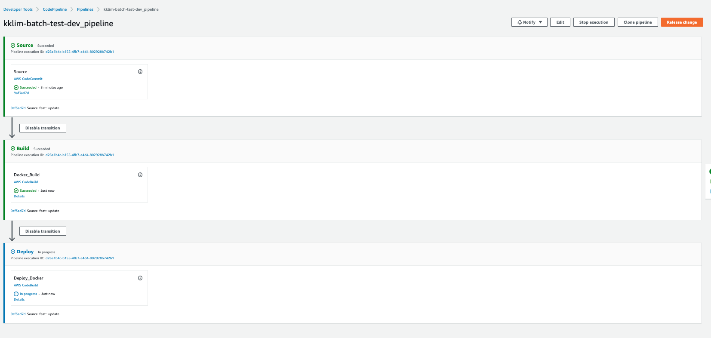
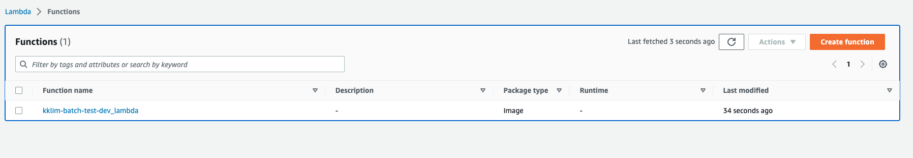
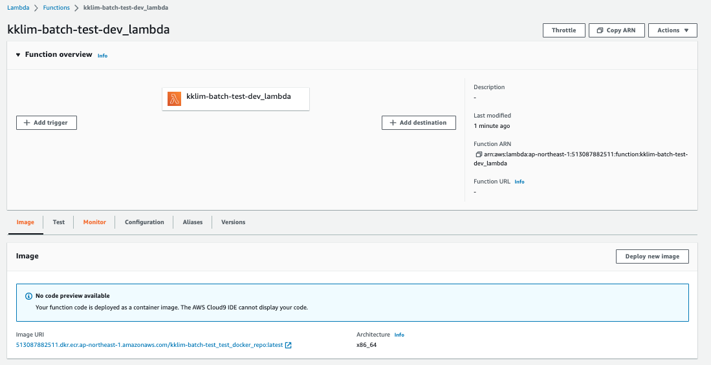
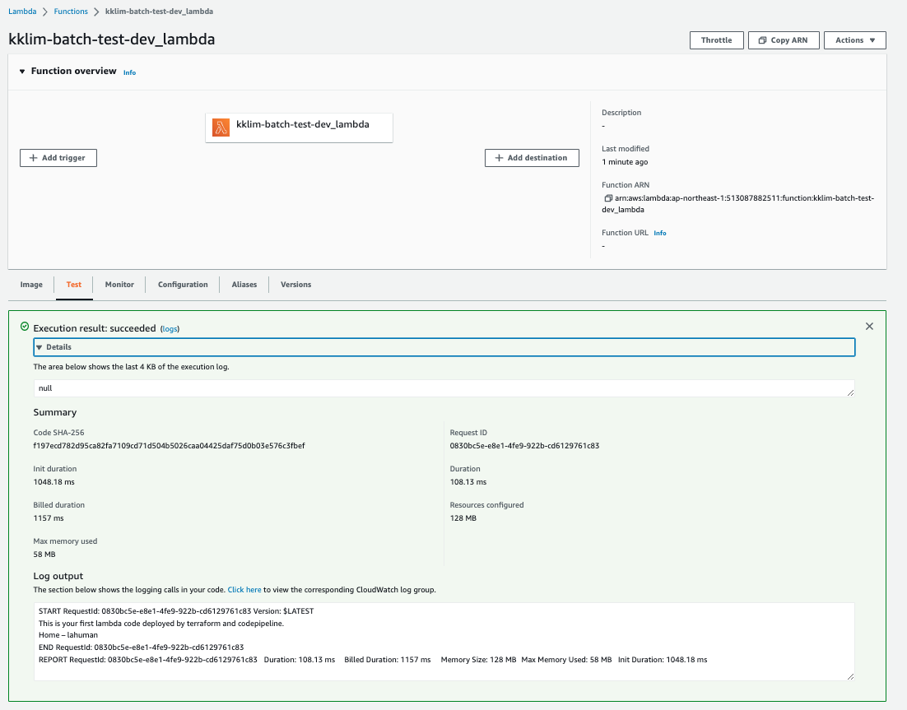

# AWS Lambda CI/CD 
## _using Terraform and CodePipeline_

이 예제는 CodePipeline 및 Terraform을 사용한 지속적인 통합 및 배포를 통해 완벽하게 작동하는 AWS Lambda 샘플 서비스를 설정하는 데 도움이 됩니다.

### 전체 구성도


## Prerequiste 

- [AWS Cli](https://aws.amazon.com/cli/)
- [Terraform Cli](https://developer.hashicorp.com/terraform/tutorials/aws-get-started/install-cli)  

## Features

- AWS Lambda Function - [bs4](https://pypi.org/project/beautifulsoup4/)를 활용해서 https://lahuman.github.io 의 title 을 출력
- CI/CD - Complete CodePipeline: [CodeCommit](https://aws.amazon.com/codecommit/), Source, Build, Deploy
- Private [Elastic Container Registry](https://aws.amazon.com/ecr/) for your AWS Lambda Code

## Instruction

프로젝트 Clone 처리

```sh
git clone https://github.com/lahuman/aws-lambda-cicd-terraform.git
cd aws-lambda-cicd-terraform/terraform
```

 `terraform.tfvars` 파일에서 주요 내용 수정

- org_name   = "ORG_NAME"
- team_name  = "TEAM_NAME"
- project_id = "PROJECT_ID"
- region     = "REGION"

```sh
terraform init
terraform apply

# * 오류 발생
# ECR에 LAMBDA에 배포할 초기 이미지가 없어서 오류 발생 

```
### 오류 발생 내용


```bash
# TODO : 자동화 처리 필요
aws ecr get-login-password --region ${REGION} | podman login --username AWS --password-stdin  ${ACCOUNT}.dkr.ecr.${REGION}.amazonaws.com
 
# LAMBDA에서 사용할 기본 이미지 가져오기
podman pull public.ecr.aws/lambda/python:3.8  

# 기본 이미지 명명 변경
podman tag public.ecr.aws/lambda/python:3.8  ${ACCOUNT}.dkr.ecr.${REGION}.amazonaws.com/kklim-batch-test_test_docker_repo:latest

# PUSH
podman push ${ACCOUNT}.dkr.ecr.${REGION}.amazonaws.com/kklim-batch-test_test_docker_repo:latest

# 재실행
terraform apply

```

### 초기 이미지 push 후 ECR 


성공시 아래와 같은 리소스들이 생성됩니다. 

- iam, role, policy, CodeCommit, Lambda function, CodePipeline, Etc

## 아직 끝나지 않았습니다. 

codeCommit에 코드를 추가해야 합니다. 

### 비어있는 repository


```sh
# move to the directory you want to make lambda code project director
git clone https://git-codecommit.${REGION}.amazonaws.com/v1/repos/${ORG_NAME}-${TEAM_NAME}-${PROJECT_ID}_test_code_repo
# copy sample code to repo directory
cp ./aws-lambda-cicd-terraform/lambdacode/* ./${ORG_NAME}-${TEAM_NAME}-${PROJECT_ID}_test_code_repo/
# move to cloned repo directory
cd ${ORG_NAME}-${TEAM_NAME}-${PROJECT_ID}_test_code_repo
# push sample code to repo
git add .
git commit -m "Initial commit"
git push
```

## CICD -빌드 및 배포 준비가 다 되었습니다. 

- AWS 웹 콘솔에서 `CodeCommit`으로 이동하세요.
- `CodePipeline` 메뉴를 클릭하세요.

- `Release` 버튼을 클릭하세요



## Checkout updated Lambda

- CodeDeploy는 CodeBuild 단계에서 빌드된 Docker 이미지와 함께 AWS Cli를 사용하여 CodeCommit에 푸시된 소스 코드로 대체합니다.



- `Lambda` 테스트





# Lambda 코드 배포 방법에 대해 고려해야 할 사항

- 이미지와 함께 람다를 배포하는 경우 AWS 웹 콘솔에서 직접 코드를 볼 수 없습니다.
- AWS에 람다 코드를 배포하는 다른 방법이 있습니다. 소스 코드를 압축하고 이를 교체하여 람다 코드를 업데이트할 수 있습니다.

## Reference
- https://github.com/aws-samples/codepipeline-for-lambda-using-terraform
- https://www.maxivanov.io/deploy-aws-lambda-to-vpc-with-terraform/

## 작업에  도움 주신분

- [신필용](https://www.shinphil.com/kr)
